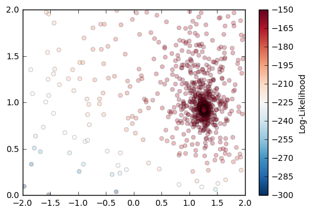

[](https://travis-ci.org/yannikbehr/nsampling)

# nsampling
nsampling is an implementation of the Nested Sampling algorithm [1]. It is
written in C++ and has a Python interface written using pybind11 [2].  

## Installation

### Dependencies
* cmake (>=3.5)

### Installing the python module
```
python setup.py install
```

### Compiling and running the C++ example
```
cd examples
make
make run
```

### Running the example Jupyter notebook
To run the Jupyter notebook you have to have `numpy` and `matplotlib` installed
in addition to `jupyter`.

```
cd examples
jupyter notebook&
```

#### _References_
[1] D.S. Sivia with J. Skilling, Data Analysis, 2006, 2nd edition, Oxford University Press

[2] https://github.com/pybind/pybind11
